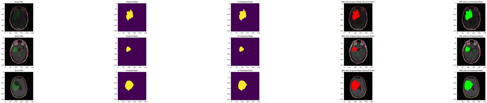
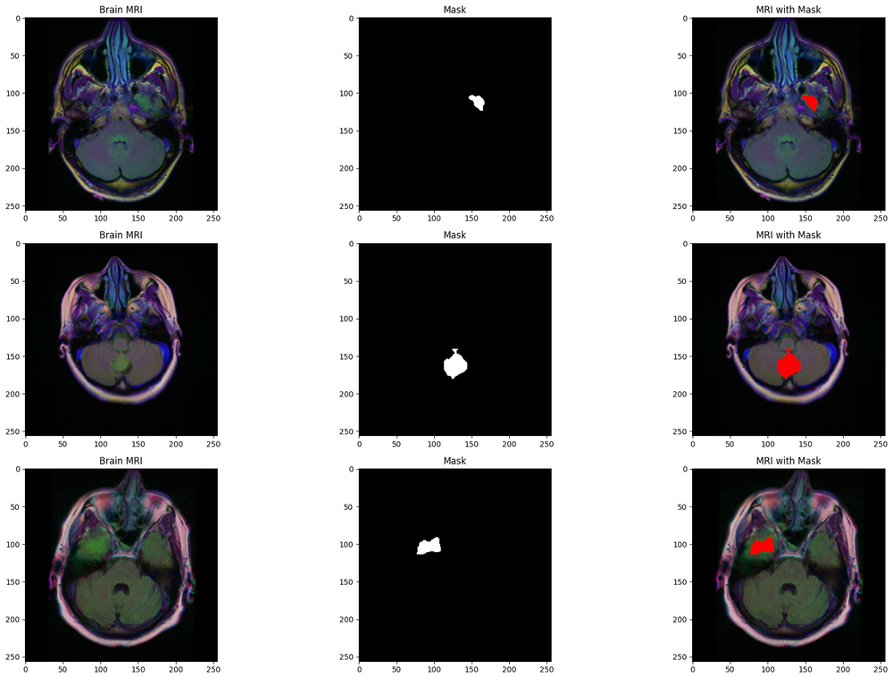
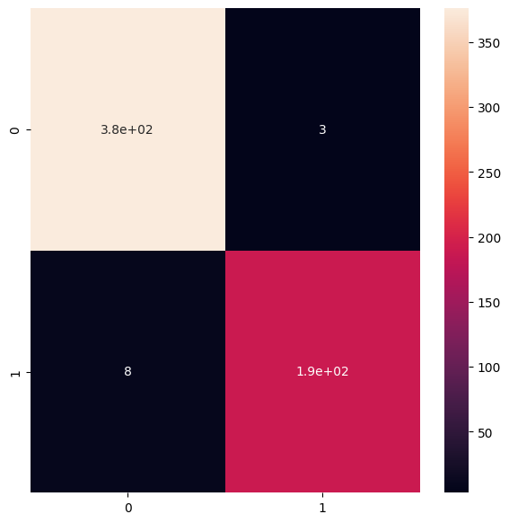

# 🧠 AI-Powered Brain Tumor Detection & Localization


A deep-learning system that **detects** and **localizes** brain tumors in MRI
scans. It chains two models into a single pipeline: a **ResNet50** classifier
that decides whether a scan contains a tumor, followed by a **ResUNet**
segmentation network that outlines the tumor at the pixel level for every scan
flagged as positive.

<p align="center">
  <b>MRI scan → [ ResNet50: tumor? ] → if yes → [ ResUNet: where? ] → pixel-level mask</b>
</p>

<p align="center">
  
  <br>
  <em>End-to-end output — for each scan: MRI · ground-truth mask · AI-predicted mask · ground-truth overlay (red) · AI-predicted overlay (green).</em>
</p>

> **Disclaimer:** This is a research / portfolio project. It is **not** a medical
> device and must not be used for actual diagnosis.

---

## Table of Contents

- [Why two models?](#why-two-models)
- [Architecture](#architecture)
- [Dataset](#dataset)
- [Results](#results)
- [Repository structure](#repository-structure)
- [Getting started](#getting-started)
- [How the code is organized](#how-the-code-is-organized)
- [Tech stack](#tech-stack)
- [Future work](#future-work)
- [License & acknowledgements](#license--acknowledgements)

---

## Why two models?

Every scan raises two clinically different questions — *is there a tumor?* and
*where is it?* — and no single model answers both cleanly:

- A **classifier** alone tells you a tumor exists but not its location.
- A **segmentation** model alone is heavier, harder to train on imbalanced data,
  and wastes compute on the ~65% of scans that are healthy.

So I use a **two-stage cascade**: a fast classifier screens *every* scan, and
only the positives are handed to the segmentation network. This is both
efficient and accurate — the same screening-then-diagnosis pattern used in real
radiology workflows.

## Architecture

| Stage | Model | Task | Key idea |
| :---: | --- | --- | --- |
| **1** | ResNet50 (transfer learning) | Binary classification — tumor vs. no tumor | Freeze an ImageNet-pretrained backbone, train only a custom softmax head |
| **2** | ResUNet + Focal Tversky loss | Semantic segmentation — pixel-level mask | U-Net encoder/decoder built from residual blocks + skip connections |

**ResUNet at a glance:**

```
Encoder (downsampling)                          Decoder (upsampling)
  Stage 1  Conv x2   (16)  ------ skip ------>  concat -> ResBlock (16)
  Stage 2  ResBlock  (32)  ------ skip ------>  concat -> ResBlock (32)
  Stage 3  ResBlock  (64)  ------ skip ------>  concat -> ResBlock (64)
  Stage 4  ResBlock (128)  ------ skip ------>  concat -> ResBlock (128)
              \                                        /
               ------>  Bottleneck ResBlock (256)  ----
  Final: Conv 1x1 + sigmoid  ->  tumor mask (256 x 256 x 1)
```

The segmentation model is trained with the **Focal Tversky loss**, which weights
missed tumor pixels more heavily than false alarms — essential because tumor
pixels are a tiny fraction of each scan. See
[`docs/PROJECT_REPORT.md`](docs/PROJECT_REPORT.md) for the full technical write-up.

## Dataset

[**LGG MRI Segmentation**](https://www.kaggle.com/mateuszbuda/lgg-mri-segmentation)
— FLAIR brain MRI scans from The Cancer Genome Atlas (TCGA), each paired with a
manually annotated binary tumor mask.

| Property | Value |
| --- | --- |
| Total scans | 3,929 |
| Tumor-negative (`mask = 0`) | 2,556 |
| Tumor-positive (`mask = 1`) | 1,373 |
| Image size | 256 × 256 × 3 |
| Mask values | 0 (background) / 255 (tumor) |

Two metadata files (`data.csv`, `data_mask.csv`) map each scan to its mask and
store the binary tumor flag.

<p align="center">
  
  <br>
  <em>Tumor-positive samples: MRI · annotated mask · mask overlaid on the scan (red).</em>
</p>

## Results

The ResNet50 classifier was evaluated on a held-out test set of **576 scans**:

| Metric | Class 0 (no tumor) | Class 1 (tumor) |
| --- | :---: | :---: |
| Precision | 0.98 | 0.98 |
| Recall | 0.99 | 0.96 |
| F1-score | 0.99 | 0.97 |

**Overall classification accuracy: 98.1%.**

<p align="center">
  
  <br>
  <em>Confusion matrix on the 576-scan test set (rows = actual, cols = predicted).</em>
</p>

The ResUNet produces tight, well-localized tumor masks — see the qualitative
results shown at the top of this README and rendered in full at the end of the
notebook.

## Repository structure

```
.
├── Brain_Tumor.ipynb        # End-to-end pipeline: EDA → classifier → segmenter → evaluation
├── models.py                # Model builders: ResNet50 classifier + ResUNet
├── train.py                 # Reproducible training — regenerates the weights + JSON files
├── predict.py               # CLI: run the trained pipeline on new MRI scans
├── utilities.py             # Custom DataGenerator, Focal Tversky loss, two-stage inference
├── requirements.txt         # Pinned Python dependencies
├── docs/
│   └── PROJECT_REPORT.md    # Technical write-up (problem, approach, results, limitations)
├── assets/                  # Result figures used in the README / report
├── LICENSE                  # MIT
├── .gitignore
└── README.md
```

**Not committed** (large / generated locally — see `.gitignore`): the MRI dataset
(`Brain_MRI/`, `data.csv`, `data_mask.csv`), the trained weights
(`weights.hdf5`, `weights_seg.hdf5`) and the serialized architectures
(`resnet-50-MRI.json`, `ResUNet-MRI.json`). Run [`train.py`](train.py) to
(re)generate the weights and architecture JSON files — see
[Getting the trained weights](#getting-the-trained-weights) below.

## Getting started

### Option A — Google Colab (recommended)

The notebook was built on Colab with a free GPU. Just open it and run:

[](https://colab.research.google.com/github/VinayakMokashi/AI-Powered-Brain-Tumor-Detection-and-Localization/blob/main/Brain_Tumor.ipynb)

1. Open the badge above (Runtime → Change runtime type → **GPU**).
2. Download the [LGG MRI dataset](https://www.kaggle.com/mateuszbuda/lgg-mri-segmentation)
   and place it in your Google Drive (e.g. `MyDrive/Brain_MRI/`).
3. Update the dataset path cell (`%cd /content/drive/MyDrive/Brain_MRI`) to match
   your folder, then run the cells top to bottom.

### Option B — Run locally

```bash
# 1. Clone
git clone https://github.com/VinayakMokashi/AI-Powered-Brain-Tumor-Detection-and-Localization.git
cd AI-Powered-Brain-Tumor-Detection-and-Localization

# 2. Create an environment and install dependencies
python -m venv .venv
# Windows:  .venv\Scripts\activate    |    macOS/Linux:  source .venv/bin/activate
pip install -r requirements.txt

# 3. Launch Jupyter
jupyter notebook Brain_Tumor.ipynb
```

When running locally, remove the `from google.colab import ...` /
`drive.mount(...)` cells and point the dataset path at your local dataset folder.
A GPU is strongly recommended for training (inference on trained weights runs
fine on CPU, just slower).

### Getting the trained weights

The notebook's evaluation sections load four files that are **not** committed
(they're large): `weights.hdf5` + `resnet-50-MRI.json` (classifier) and
`weights_seg.hdf5` + `ResUNet-MRI.json` (segmenter). You have two options.

**1. Train them yourself (fully reproducible).** [`train.py`](train.py) builds,
trains and saves all four files, after which the notebook runs end-to-end:

```bash
# trains both stages and writes the .hdf5 / .json files into the data folder
python train.py --data-dir /path/to/Brain_MRI

# handy flags:
#   --stage classifier|segmenter|all   pick a stage
#   --clf-epochs N  --seg-epochs N      epochs per stage
#   --batch-size N                      batch size (default 16)
```

**2. Use pre-trained weights (optional).** If you host your trained weights on a
[GitHub Release](https://github.com/VinayakMokashi/AI-Powered-Brain-Tumor-Detection-and-Localization/releases)
or Google Drive, drop the four files into the dataset folder and jump straight to
the evaluation cells. *(No pre-trained weights are published yet — use `train.py`
above to generate them.)*

### Run inference on new scans

Once you have the trained weights, [`predict.py`](predict.py) runs the full
pipeline on unseen scans from the command line:

```bash
# single scan
python predict.py --image path/to/scan.tif

# a folder of scans -> overlay PNGs saved in ./predictions
python predict.py --dir path/to/scans --out-dir predictions
```

For each scan it prints whether a tumor was detected and, for positives, saves a
side-by-side **MRI / predicted mask / overlay** figure (tumor region in green).

## How the code is organized

Most of the pipeline lives in the notebook, but the pieces that don't fit
off-the-shelf Keras are factored into [`utilities.py`](utilities.py):

- **`DataGenerator`** — a Keras `Sequence` that streams (MRI, mask) pairs in
  batches, resizing and normalizing on the fly so the full dataset never has to
  sit in memory.
- **`tversky` / `tversky_loss` / `focal_tversky`** — the segmentation
  metric and loss functions (see [Abraham & Khan, 2018](https://arxiv.org/abs/1810.07842)).
- **`prediction`** — runs the complete classify-then-segment inference over a
  test set and returns per-scan masks and a has-tumor flag.

The network architectures live in [`models.py`](models.py) (`build_classifier`,
`build_resunet`), [`train.py`](train.py) wires the data, models and loss together
into a single reproducible training run, and [`predict.py`](predict.py) loads the
trained models to run the pipeline on new scans.

## Tech stack

`Python` · `TensorFlow / Keras` · `NumPy` · `pandas` · `OpenCV` ·
`scikit-image` · `scikit-learn` · `Matplotlib` · `Seaborn` · `Plotly`

## Future work

- k-fold cross-validation for tighter confidence intervals on the metrics
- Hyperparameter tuning and test-time augmentation
- Uncertainty estimation on the predicted masks
- A small **Streamlit / Flask** web app for interactive, real-time inference

## License & acknowledgements

Released under the [MIT License](LICENSE).

- Dataset: [LGG MRI Segmentation](https://www.kaggle.com/mateuszbuda/lgg-mri-segmentation) (M. Buda et al.)
- ResNet: He et al., *Deep Residual Learning for Image Recognition* (2015)
- U-Net: Ronneberger et al., *U-Net: Convolutional Networks for Biomedical Image Segmentation* (2015)
- Focal Tversky loss: Abraham & Khan (2018)

---

*Built by [Vinayak Mokashi](https://github.com/VinayakMokashi).*
